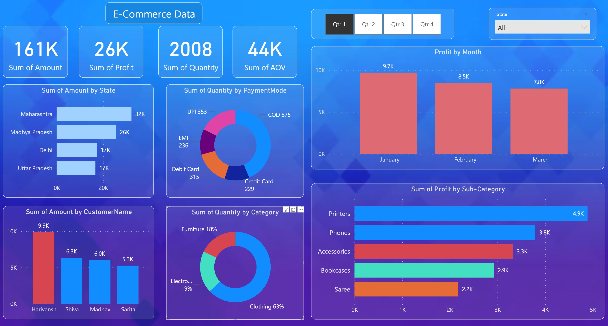

# 🛒 E-Commerce Sales Dashboard

An interactive dashboard designed to analyze e-commerce sales, profit, and customer behavior across Indian states using intuitive visualizations and KPIs.

---

## 📸 Dashboard Preview

---

## 📊 Project Overview

This project provides a clear and actionable overview of e-commerce performance metrics, helping stakeholders understand which products, customers, and states are contributing the most to revenue and profit.

---

## 🔍 Dashboard Features

### 📌 Visualizations Included:

- **Bar Chart – Sales by State:**  
  Track performance of states.

- **Donut Chart – Quantity by Payment Mode:**  
  Understand which payment methods are most used.

- **Bar Chart – Top Customers by Sales Amount:**  
  Identify high-value customers.

- **Profit by Month:**  
  Compare monthly profit trends across all year (Jan–Dec).

- **Sum of Quantity by Product Category:**  
  Track product movement and demand.

- **Profit by Sub-Category:**  
  Compare profitability of products.

---

## 🧠 Skills Demonstrated

- Data preparation & transformation  
- KPI creation (Total Sales, Profit, AOV, Quantity)  
- Interactive slicers and filters (Quarter, State)  
- Donut, bar, and column charts for storytelling  
- Color-coding and formatting for data clarity  
- Dashboard layout and visual hierarchy design

---

## 🛠️ Tools Used

- **Power BI** – Data modeling and interactive visualization  
- **Excel** – Initial data preparation (if applicable)  

