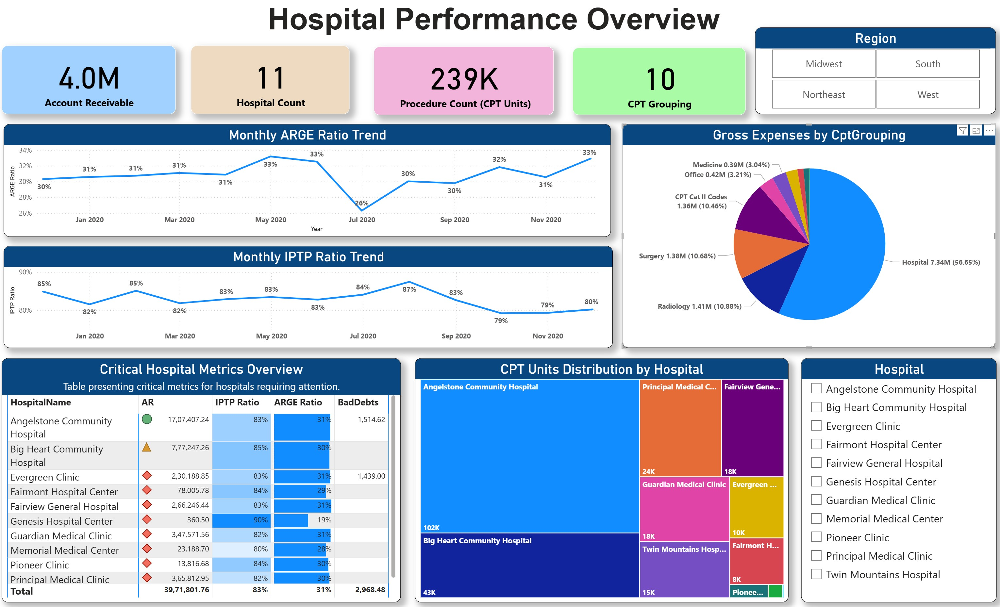
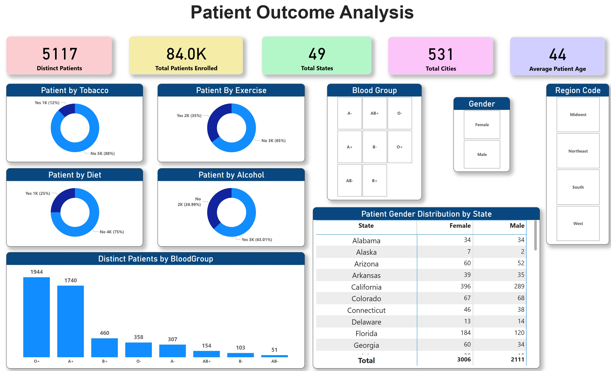
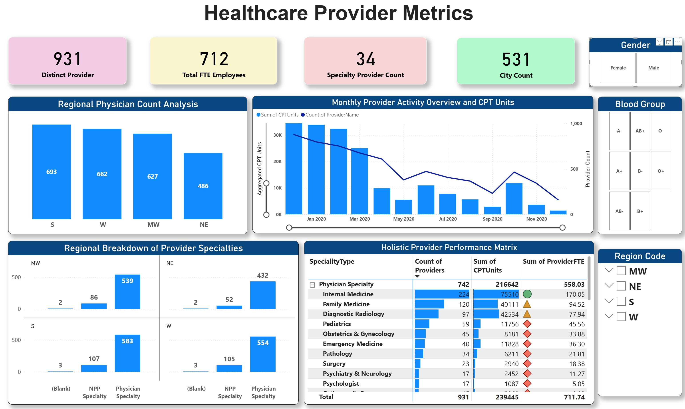
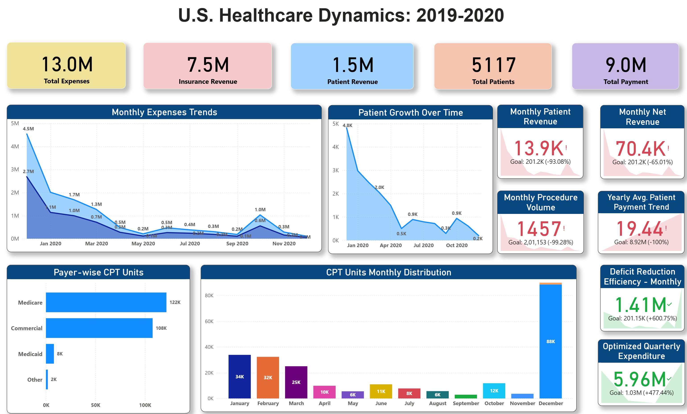

🏥 Healthcare Data Analysis (2019–2020)
This repository explores patient outcomes, provider metrics, and financial trends across the nation, offering key insights for healthcare stakeholders, data scientists, and policy researchers.

📊 Overview
This repository is organized into three major reports:

Patient Outcome Analysis

Healthcare Provider Metrics

U.S. Healthcare Dynamics Summary

📌 Key Insights
🧍‍♂️ Patient Behavior
👩‍⚕️ Gender Distribution
🩺 Provider Specialties
💸 Financial Trends
