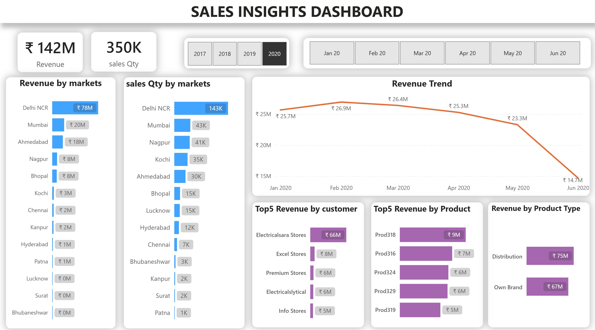
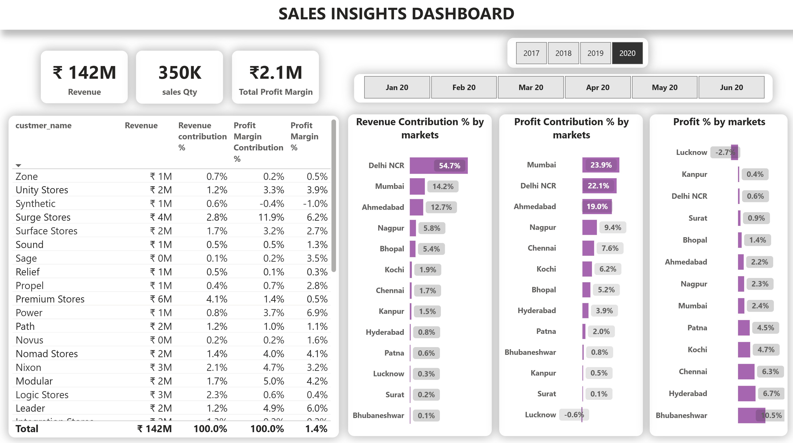

# 🛍️ Sales Insights Dashboard

A dynamic **Sales Analysis Dashboard** built for a retail business to track and understand sales performance, profitability, and product trends across various regions and customer segments.

---

## 📌 Project Overview

This dashboard showcases the analysis of retail sales data using **Power BI** to gain actionable business insights. 
It enables stakeholders to monitor 
- key performance indicators (KPIs),
- identify profitable markets,
- track product performance over time.

---

## 🧠 Skills & Concepts Demonstrated

- **Data Cleaning & Preparation**  
  Handled raw sales data with inconsistencies, missing values, and transformed it into structured, analyzable form.

- **Data Modeling**  
  Used relationships between tables (customer, product, region, sales) to create a cohesive data model for analysis.

- **Time-Series & Trend Analysis**  
  Evaluated revenue progression across months using line charts.

- **Segmentation Analysis**  
  Compared performance of:
  - Markets
  - Product types (Distribution vs Own Brand)
  - Customers
  - Products

- **Profitability Analysis**  
  Identified low-margin but high-revenue segments, and vice versa.

- **Interactive Filtering & Drill-Downs**  
  Enabled filters by year and month to analyze seasonal or month-specific insights.

---

## 🛠️ Tools Used

- **Power BI** – Interactive dashboards, slicers, visual storytelling
- **Excel** – Initial data exploration and sanity checks

